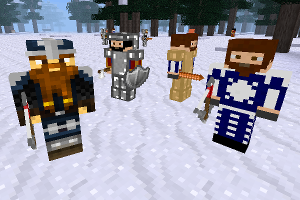

### MOBS DWARVES
  
**_Adds dwarves._**

**Version:** 0.1.1  
**Source code's license:** GPL v3.0  
**Media (Textures, Models, Sounds) license:** LGPL v2.1 - CC BY 3.0 - CC BY-SA 3.0 - CC0 (check each subfolder)

**Dependencies:** default (found in Minetest Game), mobs (Mobs redo)  
**Supported:** castle_masonry, dfcaverns, real_minerals

### Installation

Unzip the archive, rename the folder to mobs_dwarves and place it in  
../minetest/mods/

If you only want this to be used in a single world, place it in  
../minetest/worlds/WORLD_NAME/worldmods/

GNU+Linux - If you use a system-wide installation place it in  
~/.minetest/mods/

For further information or help see:  
https://wiki.minetest.net/Help:Installing_Mods
